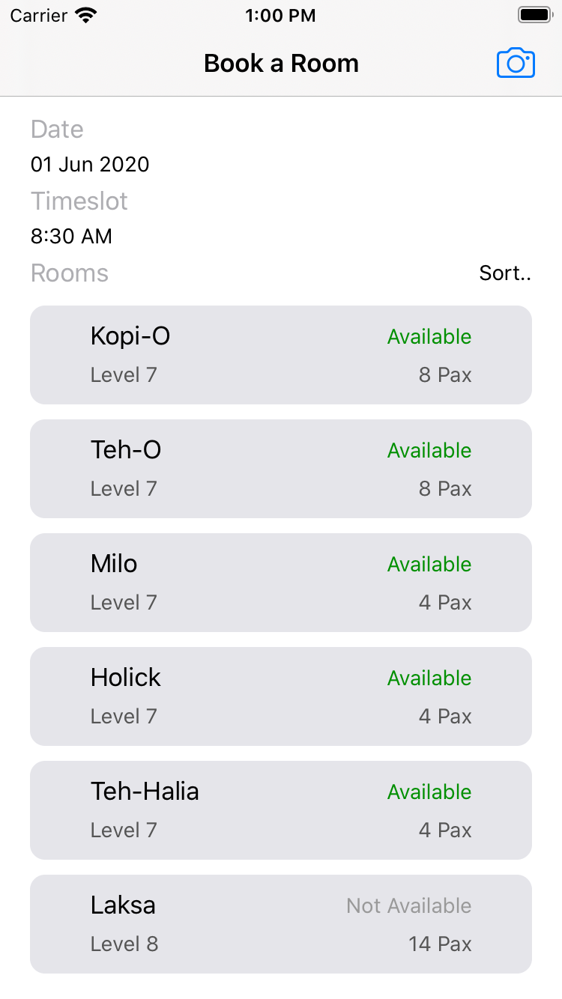
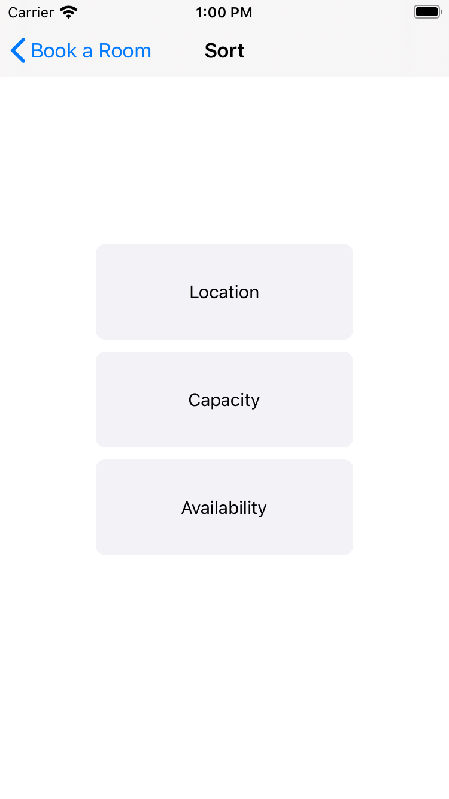

#  Room Booking App

## Objective

This is an app that allows users to check for rooms availability.

## How to use - Select a date and time..

When clicked, a date & time picker will appear.

Then user can select the date & time he needs.

Then the rooms listing will be displayed, and sorted by level in ascending order.

## How to use - Sort..

When clicked, the user can choose Location, Capacity or Availability.

Choosing Location will sort rooms listing by levels.

Choosing Capacity will sort rooms listing by capacity.

Choosing Availability will sort rooms listing by availability.

## How to use - Camera

When clicked, a camera QR Code Scanner will be launched.

After scanning the QR Code, a WebView will be displayed to show the booking results.

When user clicks the "Back to Home" button, the user will return back to the rooms listing page again.

## Sample Output

